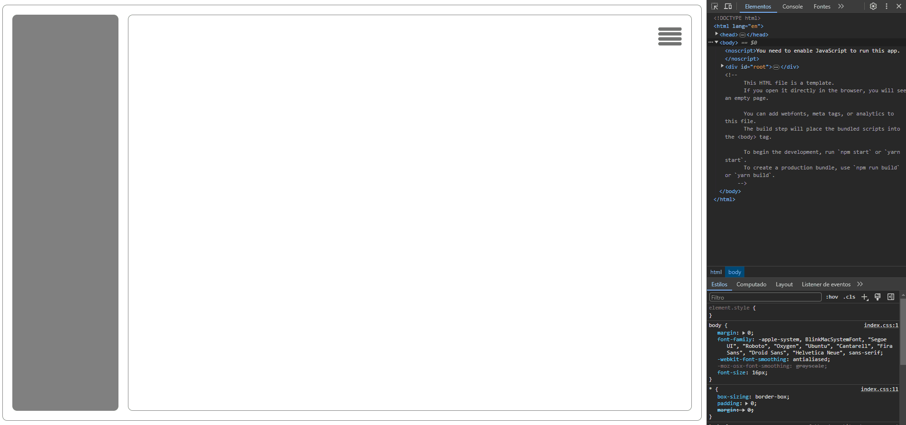

**Side Bar**

**Descrição:**
A Sidebar Responsivo é um componente fundamental para projetos web modernos, fornecendo uma navegação intuitiva e eficiente. Este componente é projetado para se adaptar a diferentes dispositivos e tamanhos de tela, oferecendo uma experiência de usuário consistente em desktops, tablets e dispositivos móveis.

**Instruções para Iniciar:**

1. **Clonar o Repositório:**

   ```bash
   git clone https://github.com/felpereira/sidebar.git
   cd sidebar
   ```

2. **Instalar Dependências:**

   ```bash
   yarn install
   ```

3. **Executar o Aplicativo em Modo de Desenvolvimento:**
   ```bash
   yarn start
   ```
   O aplicativo estará disponível em [http://localhost:3000](http://localhost:3000). Você pode visualizar a aplicação no seu navegador.

**Observações:**


